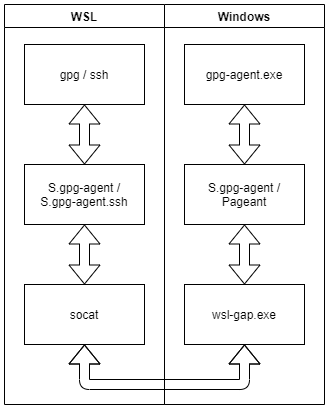

# wsl-gap

`wsl-gap` is a `gpg-agent proxy` that relays communication between `stdin/stdout` 
and the `gpg-agent` running on `Windows`.  
Together with `socat` in `WSL` it is used to forward a `socket` from `WSL` 
to the `gpg-agent` running on `Windows` to be able to access its keys from `WSL`. 
This makes it possible to use keys from a hardware dongle, like a `Yubikey`, or
a smartcard.

`wsl-gap` can be used for both `gpg` and `ssh` and works in both `WSL1` and `WSL2`.



## Usage
```
$ wsl-gap.exe -h
wsl-gap 1.0.0

USAGE:
    wsl-gap.exe [FLAGS] [socket-path]

FLAGS:
    -d, --debug      Activate debug logging to file in the same directory as the exe
        --gpg        Run as gpg-agent proxy
    -h, --help       Prints help information
        --ssh        Run as ssh-pageant proxy
        --version    Show version information

ARGS:
    <socket-path>    Path to a socket on the Windows side if not using the default
```

* The `gpg-agent` is started if not already running.
* The `GNUPGHOME` environment variable (if set) or `AppData\Roaming\gnupg` will be
  used as path to the `S.gpg-agent` socket on the `Windows` side.

### Requirements
* `GnuPG` installed and working in `Windows`, with the path to `gnupg\bin` added
  to the Windows `Path` environment variable.
* `socat` installed in `WSL`.
* `wsl-gap.exe` accessible and able to execute from `WSL`.

### SSH
To only setup for `ssh`, just export `SSH_AUTH_SOCK` and use `socat` to relay between
the socket and `wsl-gap.exe` with the `--ssh` argument.
```bash
export SSH_AUTH_SOCK=/path/to/ssh.socket
if [ ! -f "$SSH_AUTH_SOCK" ]; then
    (setsid socat UNIX-LISTEN:$SSH_AUTH_SOCK,fork EXEC:"/absolute/path/to/wsl-gap.exe --ssh" &) >/dev/null 2>&1
fi
```

### GnuPG
To use for `gpg`, configure gpg on the `WSL` side, export `GPG_AGENT_SOCK` and use 
`socat` to relay between the socket and `wsl-gap.exe` with the `--gpg` argument.  
Then import the public keys and it should work.  
**Note!** The `GNUPGHOME` cannot be the same on the `WSL` side as on the `Windows`
side, so using the users default home directory in `WSL` is a safe way.
```bash
export GNUPGHOME=/home/user/.gnupg
export GPG_AGENT_SOCK=$GNUPGHOME/S.gpg-agent
if [ ! -f "$GPG_AGENT_SOCK" ]; then
    (setsid socat UNIX-LISTEN:$GPG_AGENT_SOCK,fork EXEC:"/absolute/path/to/wsl-gap.exe --gpg" &) >/dev/null 2>&1
fi
```

## Example
In my `.bashrc` I have the function called `start_wsl_gap` for starting gpg-agent proxy and ssh-pageant proxy:
```bash
# $HOME is my home directory in Windows (/c/Users/user.name)
start_wsl_gap() {
    # GNUPGHOME in WSL/WSL2
    export GNUPGHOME=/home/user.name/.gnupg

    # Absolute path to wsl-gap.exe
    WSL_GAP_BIN=$HOME/bin/wsl-gap.exe
    # Paths to socket files.
    GPG_AGENT_SOCK_PATH=$GNUPGHOME/S.gpg-agent
    SSH_AUTH_SOCK_PATH=$GNUPGHOME/S.gpg-agent.ssh

    # Make sure the exe exists and is executable.
    chmod +x $WSL_GAP_BIN
    if [ $? -ne 0 ]; then
        echo "[$BASH_SOURCE] ERROR: $WSL_GAP_BIN not found." >&2; return 1;
    fi

    if [ ! -z $WSL_INTEROP ]; then
        # WSL2: can use the `ss` command to see if sockets exists, and if not
        # make sure that the socket file doesn't exist. Really needed? Dunno...
        SOCKETS=$(ss -lx)
        echo "$SOCKETS" | grep -q $GPG_AGENT_SOCK_PATH
        [ $? -ne 0 ] && rm -rf $GPG_AGENT_SOCK_PATH
        echo "$SOCKETS" | grep -q $SSH_AUTH_SOCK_PATH
        [ $? -ne 0 ] && rm -rf $SSH_AUTH_SOCK_PATH
    fi

    # Forward the GPG_AGENT_SOCK to stdin/stdout of the wsl-win gpg-agent proxy
    if [ ! -f "$GPG_AGENT_SOCK_PATH" ]; then
        # Use setsid to force new session to keep it running when current terminal closes
        (setsid socat UNIX-LISTEN:$GPG_AGENT_SOCK_PATH,fork EXEC:"$WSL_GAP_BIN --gpg" &) >/dev/null 2>&1
    fi
    export GPG_AGENT_SOCK=$GPG_AGENT_SOCK_PATH

    # Forward the SSH_AUTH_SOCK to stdin/stdout of the wsl-win gpg-agent proxy
    if [ ! -f "$SSH_AUTH_SOCK_PATH" ]; then
        # Use setsid to force new session to keep it running when current terminal closes
        (setsid socat UNIX-LISTEN:$SSH_AUTH_SOCK_PATH,fork EXEC:"$WSL_GAP_BIN --ssh" &) >/dev/null 2>&1
    fi
    export SSH_AUTH_SOCK=$SSH_AUTH_SOCK_PATH
}
```

## Credits
https://github.com/benpye/wsl-ssh-pageant and https://github.com/BlackReloaded/wsl2-ssh-pageant for inspiration.  
https://github.com/Yasushi/putty/ for showing how to communicate with Pageant.
